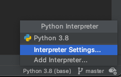
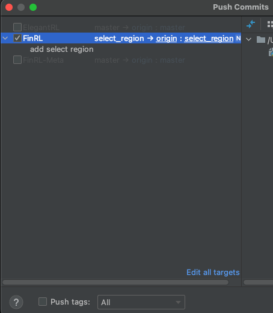

:github_url: https://github.com/AI4Finance-Foundation/FinRL

============================
Development setup with PyCharm
============================

This setup makes it easy to work on all of AI4Finance-Foundation's repositories simultaneously, while allowing easy debugging, committing to the respective repo's and creating PR's.

Step 1: Download Software
=======

-Download and install `Anaconda <https://www.anaconda.com/>`_.

-Download and install `PyCharm <https://www.jetbrains.com/pycharm/>`_.  The Community Edition (free version) offers everything you need except running Jupyter notebooks. The Full-fledged Professional Edition offers everything. A workaround to run existing notebooks in the Community edition is to copy all notebook cells into .py files.
For notebook support, you can consider PyCharm Professional Edition.

-On GitHub, fork `FinRL <https://github.com/AI4Finance-Foundation/FinRL>`_ to your private Github repo.

-On GitHub, fork `ElegantRL <https://github.com/AI4Finance-Foundation/ElegantRL>`_ to your private Github repo.

-On GitHub, fork `FinRL-Meta <https://github.com/AI4Finance-Foundation/FinRL-Meta>`_ to your private Github repo.

-All next steps happen on your local machine.

Step 2: Git Clone
=======

.. code-block:: bash

    mkdir ~/AI4Finance
    cd ~/AI4Finance
    git clone https://github.com/[your_github_username]/FinRL.git
    git clone https://github.com/[your_github_username]/ElegantRL.git
    git clone https://github.com/[your_github_username]/FinRL-Meta.git

Step 3: Create a Conda Environment
======

.. code-block:: bash

    cd ~/AI4Finance
    conda create --name ai4finance python=3.8
    conda activate ai4finance

    cd FinRL
    pip install -r requirements.txt

ElegantRL does not contain a requirements.txt, so open ElegantRL/setup.py in a text editor and pip install anything you can find under 'install_requires'

Step 4: Configure a PyCharm Project
======

-Launch PyCharm

-File > Open > [AI4Finance project folder]

-At the bottom right of the status bar, change the interpreter to the ai4finance conda environment.

.. image:: ../image/pycharm_MarkDirectoryAsSourcesRoot.png

-At the left of the screen, in the project file tree:

    - Right-click on the FinRL folder > Mark Directory as > Sources Root
    - Right-click on the ElegantRL folder > Mark Directory as > Sources Root
    - Right-click on the FinRL-Meta folder > Mark Directory as > Sources Root

-Once you run a .py file, you will notice that you may still have some missing packages.  In that case, simply pip install them.

For example, we will revise FinRL.

.. code-block:: bash

    cd ~/AI4Finance
    cd ./FinRL
    git checkout -b select_region 

where select_region is a new branch name. In this branch, we revised config.py. 

Step 5: Creating Commits and PRs/MRs
=======

-Create your commits as you usually do through PyCharm.

-Make sure each commit covers only 1 of the 3 repo's. For example, don't create a commit that spans both FinRL and ElegantRL.

-When you do a Git Push, PyCharm will ask you to which of the 3 repo's you want to push. Just like the above figure, we selected the repo FinRL. 

With respect to creating a pull request (PR) or merge quest (MR), please refer to `Create a PR <https://docs.github.com/en/pull-requests/collaborating-with-pull-requests/proposing-changes-to-your-work-with-pull-requests/creating-a-pull-request>`_ or `Opensource Create a PR <https://opensource.com/article/19/7/create-pull-request-github>`_.

