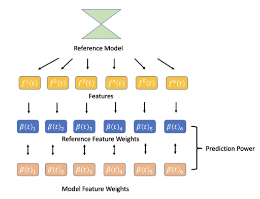
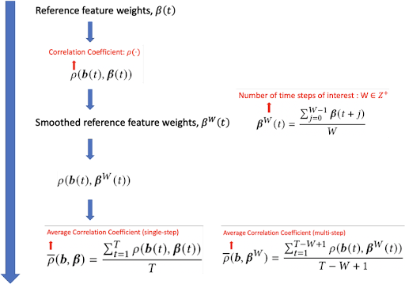
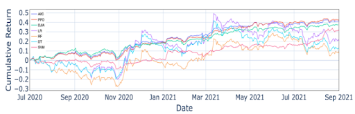
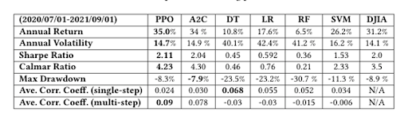

.. default-role:: math
:github_url: https://github.com/AI4Finance-LLC/FinRL-Library

Explainable FinRL: An Empirical Approach
===============================

First of all, our work aims to provide an empirical approach to explain the portfolio management task on the basis of FinRL settings. 

We propose an empirical approach to explain the strategies of DRL agents for the portfolio management task:

- Firstly, we study the portfolio management strategy using feature weights, which quantify the relationship between the reward (say, portfolio return) and the input (say, features). In particular, we use the coefficients of a linear model in hindsight as the reference feature weights.

- Secondly, for the deep reinforcement learning strategy, we use integrated gradients to define the feature weights, which are the coefficients between reward and features under a linear regression model

- Finally, we quantify the prediction power by calculating the linear correlations between the coefficients of a DRL agent and the reference feature weights, and similarly for conventional machine learning methods. Moreover, we consider both the single-step case and multiple-step case.

Step 1. Portfolio Management Task
---------------------------------------

Consider a portfolio with `N` risky assets over `T` time slots, the portfolio management task aims to maximize profit and minimize risk. Let `\mathbf{p}(t) \in \mathbb{R}^{N}` denotes the closing prices of all assets at time slot `t = 1,..., T`. \footnote{For continuous markets, the closing prices at time slot `t` is also the opening prices for time slot `t+1`.}The \textit{price relative vector} `\mathbf{y}(t) \in \mathbb{R}^{N}` is defined as the element-wise division of `\mathbf{p}(t)` by `\mathbf{p}(t-1)`:

.. math::
    \mathbf{y}(t) \triangleq \left[ \frac{\mathbf{p}_{1}(t)}{\mathbf{p}_{1} (t-1)}, \frac{\mathbf{p}_{2}(t)}{\mathbf{p}_{2}(t-1)}, ..., \frac{\mathbf{p}_{N}(t)}{\mathbf{p}_{N}(t-1)} \right]^{\top},~~ t =1, .... T,

where `\mathbf{p}(0) \in \mathbb{R}^{N}` is the vector of opening prices at `t = 1`.

Let `\mathbf{w}(t) \in \mathbb{R}^{N}` denotes the portfolio weights, which is updated at the beginning of time slot `t`. Let `v(t) \in \mathbb{R}` denotes the portfolio value at the beginning of time slot `t+1`. \footnote{Similarly `v(t)` is also the portfolio value at the ending of time slot `t`.}
Ignoring the transaction cost, we have the \textit{relative portfolio value} as the ratio between the portfolio value at the ending of time slot `t` and that at the beginning of time slot `t`,

.. math::
    \frac{v(t)}{v(t-1)} = \mathbf{w}(t)^{\top} \mathbf{y}(t),

where `v(0)` is the initial capital. The \textit{rate of portfolio return} is

.. math::
    \rho(t) \triangleq \frac{v(t)}{v(t-1)} -1 = \mathbf{w}(t)^{\top} \mathbf{y}(t) - 1,

while correspondingly the \textit{logarithmic rate of portfolio return} is

.. math::
    r(t) \triangleq \ln \frac{v(t)}{v(t-1)} = \ln(\mathbf{w}(t)^{\top}\mathbf{y}(t)).

The risk of a portfolio is defined as the variance of the rate of portfolio return `\rho(t)`:

.. math::
        &\text{Risk}(t)  \triangleq \text{Var}(\rho(t)) = \text{Var}(\mathbf{w}(t) ^{\top}\mathbf{y}(t) - 1) \\
        &= \text{Var}(\mathbf{w}(t) ^{\top}\mathbf{y}(t)) =\mathbf{w}(t) ^{\top}~\text{Cov}(\mathbf{y}(t))~\mathbf{w}(t)\\
        &=\mathbf{w}(t)^{\top}~\mathbf{\Sigma}(t)~\mathbf{w}(t),

where  `\mathbf{\Sigma}(t) = \text{Cov}(\mathbf{y}(t)) \in  \mathbb{R}^{N \times N}` is the covariance matrix of the stock returns at the end of time slot `t`.
If there is no transaction cost, the final portfolio value is

.. math::
    v(T) = v(0)~\exp\left( \sum\limits_{t=1}^{T} r(t) \right) = v(0)~ \prod\limits_{t=1}^{T} \mathbf{w}(t)^{\top}\mathbf{y}(t).

The portfolio management task aims to find a portfolio weight vector `\mathbf{w}^{*}(t) \in \mathbb{R}^{N}` such that

.. math::
    \mathbf{w}^{*}(t) \triangleq & \text{argmax}_{\mathbf{w}(t)}~~~~\mathbf{w}^{\top}(t) ~ \mathbf{y}(t) - \lambda ~ \mathbf{w}^{\top}(t)~ \mathbf{{\Sigma}}(t) ~ \mathbf{w}(t),\\
    & \text{s.t.}~~~ \sum_{i=1}^{N} \mathbf{w}_{i}(t) = 1,~~~~\mathbf{w}_{i}(t) \in [0, 1],~~~~~~t = 1,...,T

where `\lambda > 0` is the risk aversion parameter. Since
`\mathbf{y}(t)` and `\mathbf{\Sigma}(t)` are revealed at the end of time slot `t`. We estimate them at the the beginning of time slot `t`.

We use `\widehat{\mathbf{y}}(t) \in \mathbb{R}^{N}` to estimate  the price relative vector `\mathbf{y}(t)` by applying a regression model on predictive financial features based on  Capital Asset Pricing Model (CAPM).
We use `\widehat{\mathbf{\Sigma}}(t)`, the sample covariance matrix, to  estimate covariance matrix `\mathbf{\Sigma}(t)` using historical data.

Then, at the beginning of time slot `t`, our goal is to find  optimal portfolio weights

.. math::
    \mathbf{w}^{*}(t) \triangleq & \text{argmax}_{\mathbf{w}(t)}~~~~\mathbf{w}^{\top}(t) ~ \widehat{\mathbf{y}}(t) - \lambda ~ \mathbf{w}^{\top}(t)~ \widehat{\mathbf{{\Sigma}}}(t) ~ \mathbf{w}(t),\\
    &\text{s.t.}~~~ \sum_{i=1}^{N} \mathbf{w}_{i}(t) = 1,~~~~\mathbf{w}_{i}(t) \in [0, 1],~~~~~~t = 1,...,T.

Step 2. DRL Model for Portfolio Management
---------------------------------------

Similar to the tutorial FinRL: Multiple Stock Trading,  we model the portfolio management process as a Markov Decision Process (MDP). We then formulate our trading goal as a maximization problem. The algorithm is trained using Deep Reinforcement Learning (DRL) algorithms and the components of the reinforcement learning environment are:

- State: `\mathcal{S}` describes an agent's perception of a market.  The state at the beginning of time slot `t` is

.. math::
    \mathbf{s}(t) = [\mathbf{f}^{1}(t),  ... , \mathbf{f}^{K}(t), \widehat{\mathbf{\Sigma}}(t)] \in \mathbb{R}^{ N \times (N+K)}, ~~~~~~t = 1,...,T,

where  `\mathbf{f}^{k}(t) \in \mathbb{R}^{N}` denotes the vector for the `k`-th feature at the beginning of time slot `t`.

- Action: `\mathcal{A}` describes the allowed actions an agent can take at a state. In our task, the action `\mathbf{w}(t) \in \mathbb{R}^{N}`  corresponds to  the portfolio weight vector decided at the beginning of time slot `t` and should satisfy the constraints. We use a softmax layer as the last layer to meet the constraints.

- Reward function: The reward function `r(\mathbf{s}(t),\mathbf{w}(t),\mathbf{s}(t+1))` is the incentive for an agent to learn a profitable policy. We use the logarithmic rate of portfolio return in (\ref{eq:reward}) as the reward,

.. math::
    r(\mathbf{s}(t),\mathbf{w}(t),\mathbf{s}(t+1)) = \ln(\mathbf{w}^{\top}(t)\cdot\mathbf{y}(t)).

The agent takes `\mathbf{s}(t)` as input at the beginning of time slot `t` and output `\mathbf{w}(t)` as the portfolio weight vector. 

- DRL Algorithms: We use two popular deep reinforcement learning algorithms: Advantage Actor Critic (A2C)  and Proximal Policy Optimization (PPO).

- Environment: Dow Jones 30 constituent stocks from 01/01/2009 to 09/01/2021
 

Step 3. The Feature Weights for DRL Agents
---------------------------------------

Integrated Gradient (IG) integrates the gradient of the output with respect to input features. For an input `\mathbf{x} \in \mathbb{R}^n`, the `i`-th entry of integrated gradient is defined as

.. math::
 \text{IG}(\mathbf{x})_{i} \triangleq (\mathbf{x}_{i} - \mathbf{x}^{\prime}_{i}) \times \int_{z=0}^{1}\frac{\partial F(\mathbf{x}^{\prime} + z\cdot(\mathbf{x} - \mathbf{x}^{\prime}))}{\partial \mathbf{x}_{i}}dz,
    
where `F(\cdot)` denotes a DRL model, `\mathbf{x}^{\prime}` is a perturbed version of `\mathbf{x}`, say replacing all entries with zeros. It explains the relationship between a model's predictions in terms of its features.

We use the integrated gradients to measure the feature weights.
For a trained DRL agent,  the integrated gradient under policy `\pi` for the `k`-th feature of the `i`-th asset is defined as

.. math::
    \begin{split}
        & \text{IG} (\mathbf{f}^{k}(t))_{i} \\
        & = (\mathbf{f}^{k}(t)_{i} - \mathbf{f}^{k^{\prime}}(t)_{i})\\
        & \times  \int_{z = 0}^{1} \frac{\partial Q^{\pi}(\mathbf{s}_{k}'(t) + z \cdot (\mathbf{s}(t) - \mathbf{s}_{k}'(t)), \mathbf{w}(t))}{\partial \mathbf{f}^{k}(t)_{i}} d z\\
        & =\mathbf{f}^{k}(t)_{i} \cdot  \frac{\partial Q^{\pi}(\mathbf{s}_{k}'(t) + z^{k,i} \cdot (\mathbf{s}(t) - \mathbf{s}_{k}'(t)), \mathbf{w}(t))}{\partial \mathbf{f}^{k}(t)_{i}} \cdot (1 - 0)\\
        & = \mathbf{f}^{k}(t)_{i} \\
        & \cdot  \frac{\partial\mathbb{E}\left[\sum_{l=0}^{\infty}\gamma^{l}\cdot r(\mathbf{s}^{k,i}(t+l),\mathbf{w}(t+l),\mathbf{s}^{k,i}(t+l+1))|\mathbf{s}^{k,i}(t),\mathbf{w}(t)\right]}{\partial \mathbf{f}^{k}(t)_{i} }\\
        & = \mathbf{f}^{k}(t)_{i} \cdot  \sum_{l=0}^{\infty} \gamma^{l}\cdot \frac{\partial\mathbb{E}\left[ \ln(\mathbf{w}^{\top}(t+l)\cdot\mathbf{y}(t+l)) |\mathbf{s}^{k,i}(t),\mathbf{w}(t)\right]}{\partial \mathbf{f}^{k}(t)_{i} }\\
        & \approx \mathbf{f}^{k}(t)_{i} \cdot  \sum_{l=0}^{\infty} \gamma^{l}\cdot \frac{\partial\mathbb{E}\left[ \mathbf{w}^{\top}(t+l)\cdot\mathbf{y}(t+l) - 1 |\mathbf{s}^{k,i}(t),\mathbf{w}(t)\right]}{ \partial \mathbf{f}^{k}(t)_{i} }\\
        & = \mathbf{f}^{k}(t)_{i} \cdot  \sum_{l=0}^{\infty} \gamma^{l}\cdot \frac{\partial\mathbb{E}\left[ \mathbf{w}^{\top}(t+l)\cdot\mathbf{y}(t+l)|\mathbf{s}^{k,i}(t),\mathbf{w}(t)\right]}{ \partial \mathbf{f}^{k}(t)_{i} },
    \end{split}

where the first equality holds by definition, the second equality holds because of the mean value theorem, the third equality holds because

.. math::
    Q^{\pi}(\mathbf{s}(t), \mathbf{w}(t))
    \triangleq \mathbb{E}\left[\sum_{l=0}^{\infty}\gamma^{l}\cdot r(\mathbf{s}(t+l),\mathbf{w}(t+l),\mathbf{s}(t+l+1))|\mathbf{s}(t),\mathbf{w}(t)\right],

the approximation holds because `\ln(\mathbf{w}^{\top}(t)\cdot\mathbf{y}(t)) \approx \mathbf{w}^{\top}(t)\cdot\mathbf{y}(t) - 1` when `\mathbf{w}^{\top}(t)\cdot\mathbf{y}(t)` is close to 1. `\mathbf{s}_{k}'(t) \in \mathbb{R}^{N \times  (N+K)}` is a perturbed version of `\mathbf{s}(t)` by replacing the `k`-th feature with an all-zero vector.  `\mathbf{s}^{k,i}(t)` is a linear combination of original state and perturbed state `\mathbf{s}^{k,i}(t) \triangleq \mathbf{s}_{k}'(t) + z^{k,i}  \cdot (\mathbf{s}(t) - \mathbf{s}_{k}'(t))`, where `z^{k,i} \in [0,1]`.

We use a linear model to find the relationship between features and portfolio return vector q

.. math::
  \mathbf{q}^{*}(t) = b_0(t)\cdot \mathbf{1} + b_1(t)\cdot\mathbf{f}^1(t) + ... +  b_K(t)\cdot\mathbf{f}^K(t) + \mathbf{\epsilon}(t), t = 1,...,T,

Lastly, we define the feature weights of DRL agents in portfolio management task using integrated gradients and the regression coefficients.

.. math::
  \begin{eqnarray}
  &&\mathbf{M}^{\pi}(t)_k \triangleq \sum_{i=1}^{N} IG(\mathbf{f}^{k}(t))_{i}  \\
  &&\approx \sum_{i=1}^{N} \mathbf{f}^{k}(t)_{i} \cdot  \sum_{l=0}^{\infty} \gamma^{l}\cdot \frac{\partial\mathbb{E}\left[ \mathbf{w}^{\top}(t+l)\cdot\mathbf{y}(t+l) ) |\mathbf{s}^{k,i}(t),\mathbf{w}(t)\right]}{\partial \mathbf{f}^{k}(t)_{i}} \\
  &&= \sum_{i=1}^{N} \mathbf{f}^{k}(t)_{i} \cdot  \sum_{l=0}^{\infty} \gamma^{l}\cdot \mathbb{E}\left[ c_{k}(t+l) \frac{\partial\mathbf{f}^{k}(t+l)_{i}}{\partial\mathbf{f}^{k}(t)_{i}}  |\mathbf{s}^{k,i}(t),\mathbf{w}(t)\right],
  \end{eqnarray}

Step 4. The Prediction Power
---------------------------------------

Both the machine learning methods and DRL agents take profits from their prediction power. We quantify the prediction power by calculating the linear correlations between the feature weights of a DRL agent and the reference feature weights and similarly for machine learning methods. Furthermore, the machine learning methods and DRL agents are different when predicting the future. The machine learning methods rely on single-step prediction to find portfolio weights. However, the DRL agents find portfolio weights with a long-term goal. Then, we compare two cases, single-step prediction and multi-step prediction.

Step 5. Experiment & Conclusions
---------------------------------------

Our experiment environment is as follows:

Algorithms: PPO, A2C, SVM, Decision Tree, Random Forest, Linear Regression

Data: Dow Jones 30 constituent stocks, accessed at 7/1/2020. We used the data from 1/1/2009 to 6/30/2020 as a training set and the data from 7/1/2020 to 9/1/2021 as a trading set.

We used four technical indicators as features: MACD, CCI, RSI, ADX

Benchmark: Dow Jones Industrial Average (DJIA)

The experiment result shows below:

We firstly compare the portfolio performance among the algorithms

We find that the DRL methods performed best among all and we seek to explain this empirically using our proposed method.

.. image:: ../image/ExplainableFinRL-SingleStepPrediction.png

