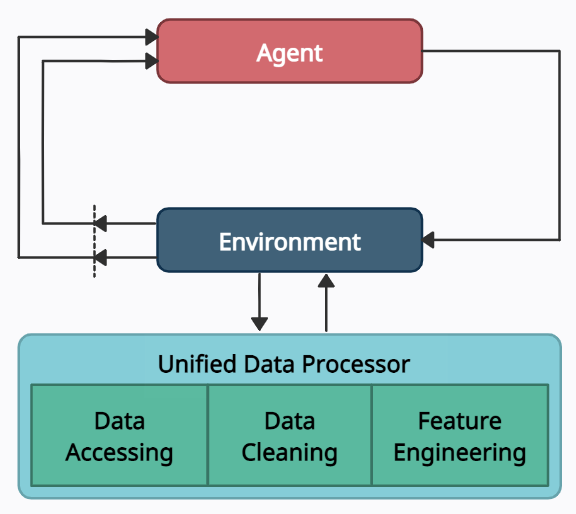
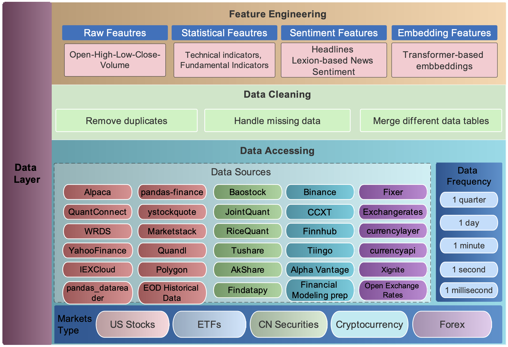

:github_url: https://github.com/AI4Finance-Foundation/FinRL

Data Layer
==========

In the data layer, we use a unified data processor to access data, clean data, and extract features.

Data Accessing
--------------

We connect data APIs of different platforms and unify them using a FinRL-Meta data processor. Users can access data from various sources given the start date, end date, stock list, time interval, and kwargs.

Data Cleaning
--------------

Raw data retrieved from different data sources are usually of various formats and have erroneous or NaN data (missing data) to different extents, making data cleaning highly time-consuming. In FinRL-Meta, we automate the data cleaning process.

The cleaning processes of NaN data are usually different for various time frequencies. For Low-frequency data, except few stocks with extremely low liquidity, the few NaN values usually mean suspension during that time interval. While for high-frequency data, NaN values are pervasive, which usually means no transaction during that time interval. To reduce the simulation-to-reality gap considering of data efficiency, we provide different solutions for these two cases.

In the low-frequency case, we directly delete the rows with NaN values, reflecting suspension in simulated trading environments. However, it is not suitable to directly delete rows with NaN values in high-frequency cases.

In our test of downloading 1-min OHLCV data of DJIA 30 companies from Alpaca during 2021–01–01~2021–05–31, there were 39736 rows for the raw data. However, after dropping rows with NaN values, only 3361 rows are left.

The low data efficiency of the dropping method is unacceptable. Instead, we take an improved forward filling method. We fill the open, high, low, close columns with the last valid value of close price and the volume column with 0, which is a standard method in practice.

Although this filling method sacrifices the authenticity of the simulated environments, it is acceptable compared to significantly improved data efficiency, especially under tickers with high liquidity. Moreover, this filling method can be further improved using bid, ask prices to reduce the simulation-to-reality gap.

Feature Engineering
-------------------

Feature engineering is the last part of the data layer. We automate the calculation of technical indicators by connecting the Stockstats or TAlib library in our data processor. Common technical indicators including Moving Average Convergence Divergence (MACD), Relative Strength Index (RSI), Average Directional Index (ADX), and Commodity Channel Index (CCI), and so on, are supported. Users can also quickly add indicators from other libraries, or add the user-defined features directly.

Users can add their features by two ways: 1) Write user-defined feature extraction functions directly. The returned features will be added to a feature array. 2) Store the features in a file, and move it to a specified folder. Then, these features will be obtained by reading from the specified file.
