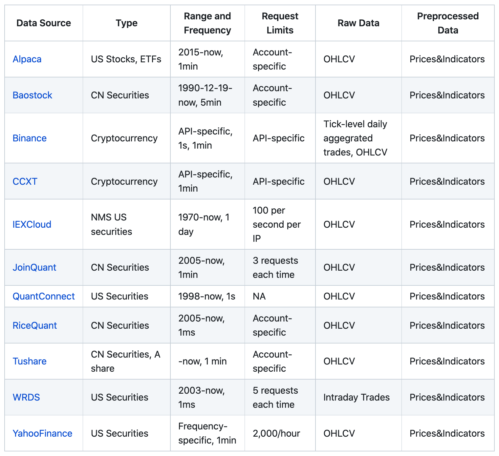

:github_url: https://github.com/AI4Finance-Foundation/FinRL

Data Layer
==========

In the data layer, we used a unified data processor to access data, clean data, and extract features.

.. image:: ../image/finrl-meta_data_layer.png
    :width: 60%
    :align: center

Data Accessing
--------------

We connect data APIs of different platforms and unify them using a FinRL-Meta data processor. Users can access data from various sources given the start date, end date, stock list, time interval, and so on.

Data Cleaning
--------------

Raw data retrieved from different data sources are usually of various formats and have erroneous or NaN data (missing data) to different extents, making data cleaning highly time-consuming. In the FinRL-Meta data processor, we automate the data cleaning process.

Feature Engineering
-------------------

Feature Engineering is the last part of the data layer. We automate the calculation of technical indicators by connecting the Stockstats or TAlib library with our data processor. Users can quickly add indicators using libraries or add user-defined features. Users can add their features by two ways: 1) Write user-defined feature extraction functions directly. The returned features will be added to a feature array. 2) Store the features in a file, and move it to a specified folder. Then, these features will be obtained by reading from the specified file.

