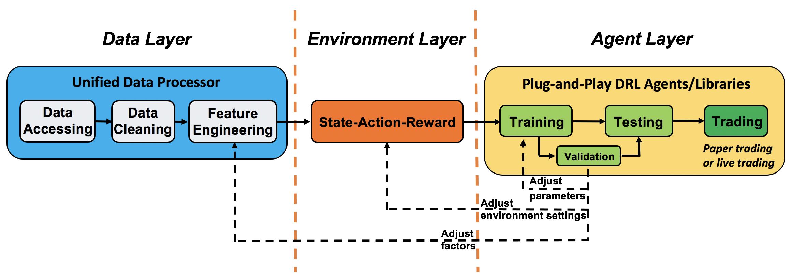
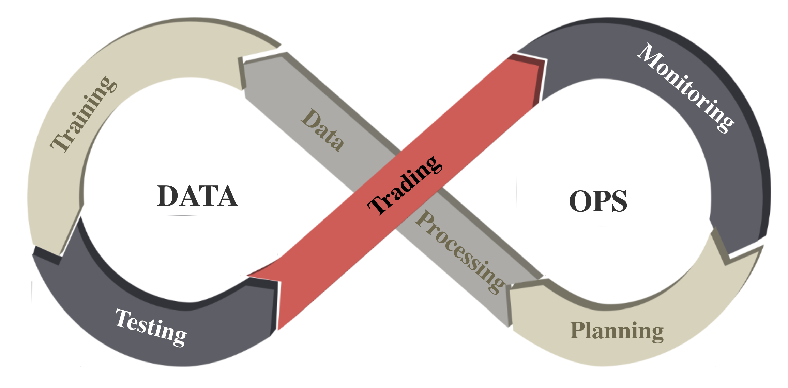

:github_url: https://github.com/AI4Finance-Foundation/FinRL

=============================
Background
=============================

Financial Big Data
===================

Stepping into the era of internet, the speed of information exchange has an exponential increment. Along with that, the amount of data also explodes into an incredible number, which generates the new concept "big data".

As its data refreshing minute-to-second, finance is one of the most typical domains that big data imbeded in. Financial big data, as a new popular field, gets more and more attention by economists, data scientists, and computer scientists.

In academia, scholors use financial big data to explore more complex and precise understanding of market and economics. While industries use financial big data to refine their analytical strategies and strengthen their prediction models. Realizing the potential of this solid background, AI4Finance community started FinRL-Meta to serve for various needs by researchers and industries.

Dataset & Benchmark
====================

With increasing intesests and demand, FinRL-Meta provides multiple datasets and benchmarks for financial reinforcement learning.

For datasets, FinRL-Meta has standardized flow of data extraction and cleaning for more than 30 different data sources. The purpose of providing the data pulling tool instead of a fixed dataset is better corresponding to the fast updating property of financial market. The dynamic construction can help users grip data according to their own requirement.

FinRL-Meta benchmarks work in famous papers and projects, covering stock trading, cyptocurrency trading, portfolio allocation, hyper-parameter tuning, etc. Along with that, there are Jupyter/Python demos that help users to design new strategies.

DataOps
=======

DataOps is a series of principles and practices to improve the quality and reduce the cycle time of data analytics. It inherits the ideas of Agile development, DevOps, and lean manufacturing and applies them to the data analytics field. 

Many implementations of DataOps have been developed in companies and organizations to improve the quality and efficiency of data analytics. These implementations consolidate various data sources, unify and automate the pipeline of data analytics, including data accessing, cleaning, analysis, visualization, and governance with a control system orchestrating, monitoring, and testing the data analytics pipeline. 

However, the methodology of DataOps has not been applied to DRL researches in quantitative finance. Most researchers in financial DRL access data, clean data, and extract factors in a case-by-case manner, which involves heavy manual work and may not guarantee the data quality.

We follow the DataOps paradigm in the data layer.

1. we establish a standard pipeline for financial data engineering in RL, ensuring data of different formats from different sources can be incorporated in a unified framework.
2. we automate this pipeline with a data processor, which can access data, clean data, and extract features from various data sources with high quality and efficiency. Our data layer provides agility to model deployment.
3. we employ a training-testing-trading pipeline. The DRL agent first learns from the training environment and is then validated in the validation environment for further adjustment. Then the validated agent is tested in historical datasets. Finally, the tested agent will be deployed in paper trading or live trading markets. First, this pipeline solves the information leakage problem because the trading data are never leaked when adjusting agents. Second, a unified pipeline allows fair comparisons among different algorithms and strategies.

