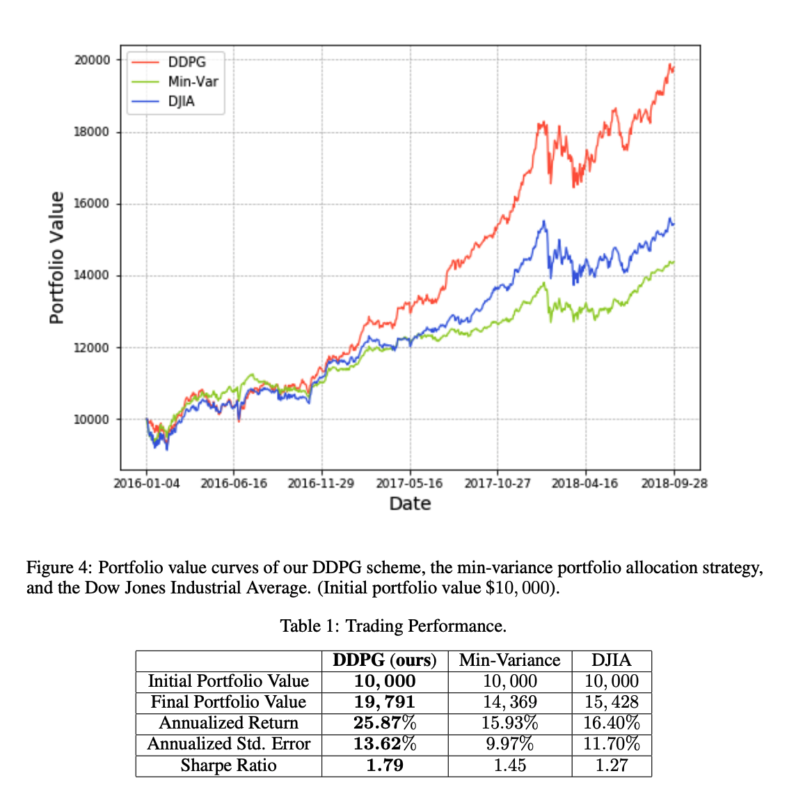

:github_url: https://github.com/AI4Finance-LLC/FinRL-Library

First Glance
============================

To quickly understand what is FinRL and how it works, you can go through the notebook *Stock_NeurIPS2018.ipynb* in our tutorial (https://github.com/AI4Finance-Foundation/FinRL/tree/master/tutorials/1-Introduction)

This is how we use Deep Reinforcement Learning for Stock Trading from scratch.

.. tip::

    Run the code step by step at `Google Colab`_.

    .. _Google Colab: https://colab.research.google.com/github/AI4Finance-Foundation/FinRL/blob/master/Stock_NeurIPS2018.ipynb

The notebook and the following result is based on our paper *Practical deep reinforcement learning approach for stock trading* Xiong, Zhuoran, Xiao-Yang Liu, Shan Zhong, Hongyang Yang, and Anwar Walid. "Practical deep reinforcement learning approach for stock trading." arXiv preprint arXiv:1811.07522 (2018).

