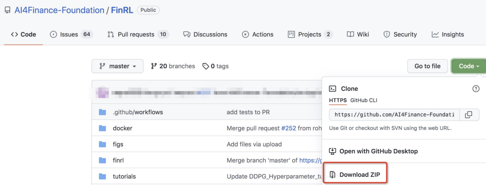

:github_url: https://github.com/AI4Finance-Foundation/FinRL

============================
Installation
============================

MAC OS
=======

Step 1: Install `Anaconda <https://www.anaconda.com/products/individual>`_
---------------------------------------------------------------------------------------------

-Download `Anaconda Installer <https://www.anaconda.com/products/individual#macos>`_, Anaconda has everything you need for Python programming.

-Follow Anaconda’s instruction: `macOS graphical install <https://docs.anaconda.com/anaconda/install/mac-os/>`_, to install the newest version of Anaconda.

-Open your terminal and type: *'which python'*, it should show:

.. code-block:: bash

   /Users/your_user_name/opt/anaconda3/bin/python

It means that your Python interpreter path has been pinned to Anaconda’s python version. If it shows something like this:

.. code-block:: bash

   /Users/your_user_name/opt/anaconda3/bin/python

It means that you still use the default python path, you either fix it and pin it to the anaconda path (`try this blog <https://towardsdatascience.com/how-to-successfully-install-anaconda-on-a-mac-and-actually-get-it-to-work-53ce18025f97>`_), or you can use Anaconda Navigator to open a terminal manually.

Step 2: Install `Homebrew <https://brew.sh/>`_
---------------------------------------------------------------------

-Open a terminal and make sure that you have installed Anaconda.

-Install Homebrew:

.. code-block:: bash

   /bin/bash -c "$(curl -fsSL https://raw.githubusercontent.com/Homebrew/install/HEAD/install.sh)"

Step 3: Install `OpenAI <https://github.com/openai/baselines>`_
-----------------------------------------------------------------

Installation of system packages on Mac requires Homebrew. With Homebrew installed, run the following in your terminal:

.. code-block:: bash

   brew install cmake openmpi

Step 4: Install `FinRL <https://github.com/AI4Finance-Foundation/FinRL>`_
--------------------------------------------------------------------------

Since we are still actively updating the FinRL repository, please install the unstable development version of FinRL using pip:

.. code-block:: bash

   pip install git+https://github.com/AI4Finance-Foundation/FinRL.git

Step 5: Install box2d (if using box2d)
--------------------------------------------------------------------------
Users can try:

.. code-block:: bash

  brew install swig
  pip install box2d-py
  pip install box2d
  pip install Box2D

If it raises errors "AttributeError: module '_Box2D' has no attribute 'RAND_LIMIT_swigconstant' ", users can try:

.. code-block:: bash

  pip install box2d box2d-kengz

Step 6: Run `FinRL <https://github.com/AI4Finance-Foundation/FinRL>`_
--------------------------------------------------------------------------

Download the FinRL-Tutorials repository either use terminal:

.. code-block:: bash

   git clone https://github.com/AI4Finance-Foundation/FinRL-Tutorials.git

or download it manually

Open Jupyter Notebook through Anaconda Navigator and locate one of the stock trading notebook in FinRL-Tutorials you just downloaded. You should be able to run it.

Ubuntu
=======

Step 1: Install `Anaconda <https://www.anaconda.com/products/individual>`_
----------------------------------------------------------------------------

Please follow the steps in this `blog <https://linuxize.com/post/how-to-install-anaconda-on-ubuntu-18-04/>`_

Step 2: Install `OpenAI <https://github.com/openai/baselines>`_
----------------------------------------------------------------

Open an ubuntu terminal and type:

.. code-block:: bash

   sudo apt-get update && sudo apt-get install cmake libopenmpi-dev python3-dev zlib1g-dev libgl1-mesa-glx swig

Step 3: Install `FinRL <https://github.com/AI4Finance-Foundation/FinRL>`_
--------------------------------------------------------------------------

Since we are still actively updating the FinRL repository, please install the unstable development version of FinRL using pip:

.. code-block:: bash

   pip install git+https://github.com/AI4Finance-Foundation/FinRL.git

Step 4: Install box2d (if using box2d)
--------------------------------------------------------------------------

Step 5: Run `FinRL <https://github.com/AI4Finance-Foundation/FinRL>`_
--------------------------------------------------------------------------

Download the FinRL repository in terminal:

.. code-block:: bash

   git clone https://github.com/AI4Finance-Foundation/FinRL.git

Open Jupyter Notebook by typing 'jupyter notebook' in your ubuntu terminal.

Locate one of the stock trading notebook in FinRL/tutorials you just downloaded. You should be able to run it.

Windows 10
======================
Prepare for install
--------------------------------------------------------------------------
1. VPN is needed if using YahooFinance in china (pyfolio, elegantRL pip dependencies need pull code, YahooFinance has stopped the service in china). Otherwise, please ignore it.
2. python version >=3.7
3. pip remove zipline, if your system has installed zipline, zipline has conflicts with the FinRL.

Step 1: Clone `FinRL <https://github.com/AI4Finance-Foundation/FinRL>`_
--------------------------------------------------------------------------
.. code-block:: bash

   git clone https://github.com/AI4Finance-Foundation/FinRL.git

Step 2: install dependencies
--------------------------------------------------------------------------
.. code-block:: bash

    cd FinRL
    pip install .

Step 3: Install box2d (if using box2d)
--------------------------------------------------------------------------

Step 4:  test (If using YahooFinance in China, VPN is needed)
-------------------------------------------------------------------------------------
.. code-block:: bash

    python Stock_NeurIPS2018.py

Tips for running error
--------------------------------------------------------------------------

If the following outputs appear, take it easy, since installation is still successful.

1. UserWarning: Module "zipline.assets" not found; multipliers will not be applied to position notionals. Module "zipline.assets" not found; multipliers will not be applied'

If following outputs appear, please ensure that VPN helps to access the YahooFinance

1. Failed download: xxxx: No data found for this date range, the stock may be delisted, or the value is missing.

Windows 10 (wsl install)
=========================

Step 1: Install Ubuntu on Windows 10
--------------------------------------
Please check this video for detailed steps:

.. raw:: html

   <iframe width="692" height="389" src="https://www.youtube.com/embed/X-DHaQLrBi8" title="YouTube video player" frameborder="0" allow="accelerometer; autoplay; clipboard-write; encrypted-media; gyroscope; picture-in-picture" allowfullscreen></iframe>

Step 2: Install `Anaconda <https://www.anaconda.com/products/individual>`_
----------------------------------------------------------------------------

Please follow the steps in this `blog <https://linuxize.com/post/how-to-install-anaconda-on-ubuntu-18-04/>`_

Step 3: Install `OpenAI <https://github.com/openai/baselines>`_
----------------------------------------------------------------

Open an ubuntu terminal and type:

.. code-block:: bash

   sudo apt-get update && sudo apt-get install cmake libopenmpi-dev python3-dev zlib1g-dev libgl1-mesa-glx swig

Step 4: Install `FinRL <https://github.com/AI4Finance-Foundation/FinRL>`_
--------------------------------------------------------------------------

Since we are still actively updating the FinRL repository, please install the unstable development version of FinRL using pip:

.. code-block:: bash

   pip install git+https://github.com/AI4Finance-Foundation/FinRL.git

Step 5: Install box2d (if using box2d)
--------------------------------------------------------------------------

Step 6: Run `FinRL <https://github.com/AI4Finance-Foundation/FinRL>`_
--------------------------------------------------------------------------

Download the FinRL-Tutorials repository in terminal:

.. code-block:: bash

   git clone https://github.com/AI4Finance-Foundation/FinRL-Tutorials.git

Open Jupyter Notebook by typing 'jupyter notebook' in your ubuntu terminal. Please see `jupyter notebook <https://jupyter-notebook-beginner-guide.readthedocs.io/en/latest/execute.html>`_

Locate one of the stock trading notebook in FinRL-Tutorials you just downloaded. You should be able to run it.
