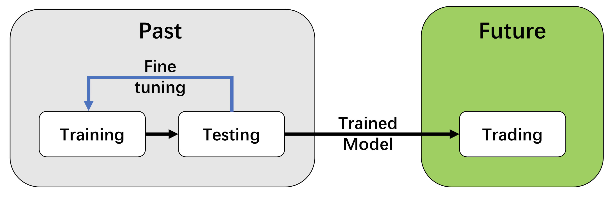

:github_url: https://github.com/AI4Finance-Foundation/FinRL

============================
1. Stock Market Environments
============================

Considering the stochastic and interactive nature of the automated stock trading tasks, a financial task is modeled as a Markov Decision Process (MDP) problem. FinRL-Meta first preprocesses the market data, and then builds stock market environments. The environemnt observes the change of stock price and multiple features, and the agent takes an action and receives the reward from the environment, and finally the agent adjusts its strategy accordingly. By interacting with the environment, the smart agent will derive a trading strategy to maximize the long-term accumulated rewards (also named as Q-value).

Our trading environments, based on OpenAI Gym, simulate the markets with real market data, using time-driven simulation. FinRL library strives to provide trading environments constructed by datasets across many stock exchanges.

In the Tutorials and Examples section, we will illustrate the detailed MDP formulation with the components of the reinforcement learning environment.

The application of DRL in finance is different from that in other fields, such as playing chess and card games; the latter inherently have clearly defined rules for environments. Various finance markets require different DRL algorithms to get the most appropriate automated trading agent. Realizing that setting up a training environment is time-consuming and laborious work, FinRL provides market environments based on representative listings, including NASDAQ-100, DJIA, S&P 500, SSE 50, CSI 300, and HSI, plus a user-defined environment. Thus, this library frees users from tedious and time-consuming data pre-processing workload. We know that users may want to train trading agents on their own data sets. FinRL library provides convenient support to user-imported data and allows users to adjust the granularity of time steps. We specify the format of the data. According to our data format instructions, users only need to pre-process their data sets.

.. image:: ../../image/finrl_meta_dataops.png
   :width: 80%
   :align: center

We follow the DataOps paradigm in the data layer.

- We establish a standard pipeline for financial data engineering in RL, ensuring data of **different formats** from different sources can be incorporated in **a unified framework**.

- We automate this pipeline with a **data processor**, which can access data, clean data, and extract features from various data sources with high quality and efficiency. Our data layer provides agility to model deployment.

- We employ a **training-testing-trading pipeline**. The DRL agent first learns from the training environment and is then validated in the validation environment for further adjustment. Then the validated agent is tested in historical datasets. Finally, the tested agent will be deployed in paper trading or live trading markets. First, this pipeline **solves the information leakage problem** because the trading data are never leaked when adjusting agents. Second, a unified pipeline **allows fair comparisons** among different algorithms and strategies.

For data processing and building environment for DRL in finance, AI4Finance has maintained another project: `FinRL-Meta <https://github.com/AI4Finance-Foundation/FinRL-Meta>`_.
