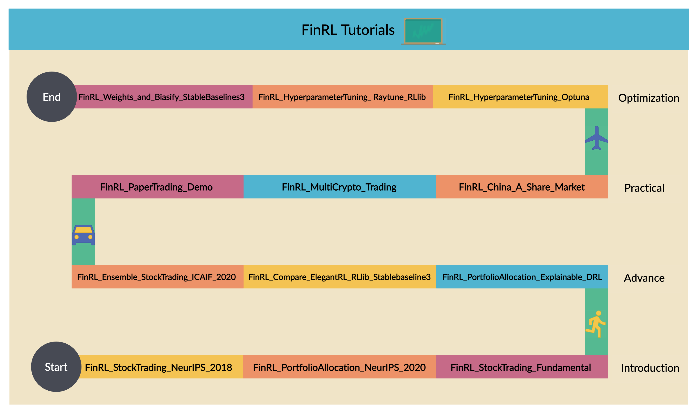

:github_url: https://github.com/AI4Finance-Foundation/FinRL

Tutorials Guide
========================

Welcome to FinRL's tutorial! In this section, you can walk through the tutorial notebooks we prepared. If you are new to FinRL, we would suggest you the following sequence:

Mission: provide user-friendly demos in notebook or python. 

 

Outline

1-Introduction: basic demos for beginners.

2-Advance: advanced demos, e.g., ensemble stock trading.

3-Practical: paper trading and live trading.

4-Optimization: hyperparameter tuning.

5-Others: other demos.

.. toctree::
   :maxdepth: 1

   1-Introduction
   2-Advance
   3-Practical
   4-Optimization
   5-Others

