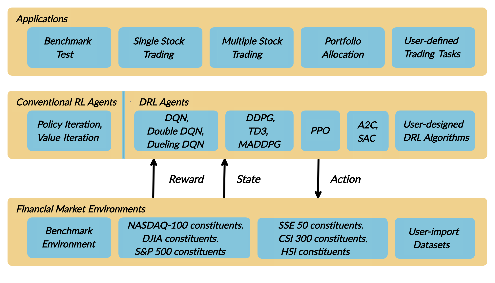
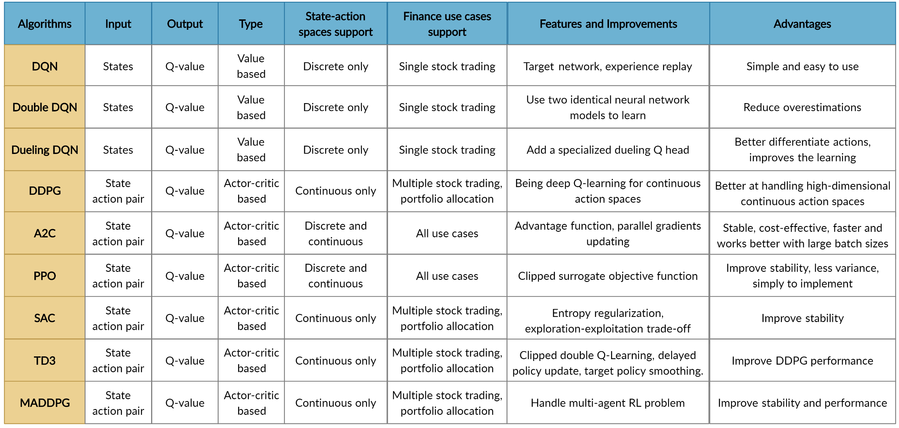

:github_url: https://github.com/AI4Finance-LLC/FinRL-Library

Tutorial for Multiple Stock Trading
=====================================

**Our paper**: 
`FinRL: A Deep Reinforcement Learning Library for Automated Stock Trading in Quantitative Finance`_. 

.. _FinRL\: A Deep Reinforcement Learning Library for Automated Stock Trading in Quantitative Finance: https://arxiv.org/abs/2011.09607

Presented at NeurIPS 2020: Deep RL Workshop.

The Jupyter notebook codes are available on our Github_ and `Google Colab`_.

.. _Github: https://github.com/AI4Finance-LLC/FinRL-Library
.. _Google Colab: https://colab.research.google.com/github/AI4Finance-LLC/FinRL-Library/blob/master/FinRL_single_stock_trading.ipynb

.. tip::

    - FinRL `Single Stock Trading`_ at Google Colab.
    
    .. _Single Stock Trading: https://colab.research.google.com/github/AI4Finance-LLC/FinRL-Library/blob/master/FinRL_single_stock_trading.ipynb
    
    - FinRL `Multiple Stocks Trading`_ at Google Colab: 

    .. _Multiple Stocks Trading: https://colab.research.google.com/github/AI4Finance-LLC/FinRL-Library/blob/master/FinRL_multiple_stock_trading.ipynb

Overview
-------------

To begin with, I would like explain the logic of multiple stock trading using Deep Reinforcement Learning.

We use Dow 30 constituents as an example throughout this article, because those are the most popular stocks.

A lot of people are terrified by the word “Deep Reinforcement Learning”, actually, you can just treat it as a “Smart AI” or “Smart Stock Trader” or “R2-D2 Trader” if you want, and just use it.

Suppose that we have a well trained DRL agent “DRL Trader”, we want to use it to trade multiple stocks in our portfolio.

    - Assume we are at time t, at the end of day at time t, we will know the open-high-low-close price of the Dow 30 constituents stocks. We can use these information to calculate technical indicators such as MACD, RSI, CCI, ADX. In Reinforcement Learning we call these data or features as “states”.
    
    - We know that our portfolio value V(t) = balance (t) + dollar amount of the stocks (t).
    
    - We feed the states into our well trained DRL Trader, the trader will output a list of actions, the action for each stock is a value within [-1, 1], we can treat this value as the trading signal, 1 means a strong buy signal, -1 means a strong sell signal.
   
    - We calculate k = actions \*h_max, h_max is a predefined parameter that sets as the maximum amount of shares to trade. So we will have a list of shares to trade.
    
    - The dollar amount of shares = shares to trade* close price (t).
    
    - Update balance and shares. These dollar amount of shares are the money we need to trade at time t. The updated balance = balance (t) −amount of money we pay to buy shares +amount of money we receive to sell shares. The updated shares = shares held (t) −shares to sell +shares to buy.
    
    - So we take actions to trade based on the advice of our DRL Trader at the end of day at time t (time t’s close price equals time t+1’s open price). We hope that we will benefit from these actions by the end of day at time t+1.
    
    - Take a step to time t+1, at the end of day, we will know the close price at t+1, the dollar amount of the stocks (t+1)= sum(updated shares * close price (t+1)). The portfolio value V(t+1)=balance (t+1) + dollar amount of the stocks (t+1).
    
    - So the step reward by taking the actions from DRL Trader at time t to t+1 is r = v(t+1) − v(t). The reward can be positive or negative in the training stage. But of course, we need a positive reward in trading to say that our DRL Trader is effective.
    
    - Repeat this process until termination.
    
Below are the logic chart of multiple stock trading and a made-up example for demonstration purpose:

.. image:: ../image/multiple_1.jpeg
    :scale: 60%
.. image:: ../image/multiple_2.png

Multiple stock trading is different from single stock trading because as the number of stocks increase, the dimension of the data will increase, the state and action space in reinforcement learning will grow exponentially. So stability and reproducibility are very essential here.

We introduce a DRL library FinRL that facilitates beginners to expose themselves to quantitative finance and to develop their own stock trading strategies.

FinRL is characterized by its reproducibility, scalability, simplicity, applicability and extendibility.

This article is focusing on one of the use cases in our paper: Mutiple Stock Trading. We use one Jupyter notebook to include all the necessary steps.

Problem Definition
-----------------------------

This problem is to design an automated trading solution for multiple stock trading. We model the stock trading process as a Markov Decision Process (MDP). We then formulate our trading goal as a maximization problem.

The components of the reinforcement learning environment are:

    - **Action**: {−k, …, −1, 0, 1, …, k}, where k denotes the number of shares. For 30 stocks the entire action space is (2k+1)³⁰, in this article we use k≤h_max=100, so the entire action space is around 10⁶⁰. It means we can sample a maximum of 10⁶⁰ pairs of state and action combinations.

    - **State**: {balance, close price, shares, MACD, RSI, CCI, ADX}, 181-dimensional vector (30 stocks * 6 + 1)
    
    - **Reward function**: r(s, a, s′) = v′ − v, where v′ and v represent the portfolio values at state s′ and s, respectively
    
    - **Environment**: multiple stock trading for Dow 30 constituents.

The data of the Dow 30 constituents stocks that we will be using for this case study is obtained from Yahoo Finance API. The data contains Open-High-Low-Close price and volume.

Load Python Packages
-----------------------------

Install the unstable development version of FinRL:

.. code-block::
   :linenos:

    # Install the unstable development version in Jupyter notebook:
    !pip install git+https://github.com/AI4Finance-LLC/FinRL-Library.git

.. code-block:: python
   :linenos:

    # import packages
    import pandas as pd
    import numpy as np
    import matplotlib
    import matplotlib.pyplot as plt
    matplotlib.use('Agg')
    import datetime
    from finrl.config import config
    from finrl.marketdata.yahoodownloader import YahooDownloader
    from finrl.preprocessing.preprocessors import FeatureEngineer
    from finrl.preprocessing.data import data_split
    from finrl.env.environment import EnvSetup
    from finrl.env.EnvMultipleStock_train import StockEnvTrain
    from finrl.env.EnvMultipleStock_trade import StockEnvTrade
    from finrl.model.models import DRLAgent
    from finrl.trade.backtest import BackTestStats, BaselineStats, BackTestPlot

Download Data
-----------------------------

FinRL uses a YahooDownloader_ class to extract data.

.. _YahooDownloader: https://github.com/AI4Finance-LLC/FinRL-Library/blob/master/finrl/marketdata/yahoodownloader.py

.. code-block:: python

    class YahooDownloader:
        """
        Provides methods for retrieving daily stock data from Yahoo Finance API
        
        Attributes
        ----------
            start_date : str
                start date of the data (modified from config.py)
            end_date : str
                end date of the data (modified from config.py)
            ticker_list : list
                a list of stock tickers (modified from config.py)
                
        Methods
        -------
            fetch_data()
                Fetches data from yahoo API
        """

Download and save the data in a pandas DataFrame:

.. code-block:: python
   :linenos:

    # Download and save the data in a pandas DataFrame:
    df = YahooDownloader(start_date = '2009-01-01', 
                              end_date = '2020-09-30', 
                              ticker_list = config.DOW_30_TICKER).fetch_data()
                              
    print(df.sort_values(['date','tic'],ignore_index=True).head(30))
    

.. image:: ../image/multiple_3.png

Preprocess Data
-----------------------------

FinRL uses a FeatureEngineer_ class to preprocess data.

.. _FeatureEngineer: https://github.com/AI4Finance-LLC/FinRL-Library/blob/master/finrl/preprocessing/preprocessors.py

.. code-block: python

    class FeatureEngineer:
        """
        Provides methods for preprocessing the stock price data
        
        Attributes
        ----------
            df: DataFrame
                data downloaded from Yahoo API
            feature_number : int
                number of features we used
            use_technical_indicator : boolean
                we technical indicator or not
            use_turbulence : boolean
                use turbulence index or not
        Methods
        -------
            preprocess_data()
                main method to do the feature engineering
        """

Perform Feature Engineering:

.. code-block:: python
   :linenos:

    # Perform Feature Engineering:
    df = FeatureEngineer(df.copy(),
                         use_technical_indicator=True,
                         tech_indicator_list = config.TECHNICAL_INDICATORS_LIST,
                         use_turbulence=True,
                         user_defined_feature = False).preprocess_data()
                         
                         
.. image:: ../image/multiple_4.png

**Train & Trade Data Split**:

In real life trading, the model needs to be updated periodically using rolling windows. In this article, we just cut the data once into train and trade set.

Build Environment
-----------------------------

FinRL uses a EnvSetup_ class to setup environment.

.. _EnvSetup: https://github.com/AI4Finance-LLC/FinRL-Library/blob/master/finrl/env/environment.py

.. code-block:: python

    class EnvSetup:
        """
        Provides methods for retrieving daily stock data from Yahoo Finance API
    
        Attributes
        ----------
            stock_dim: int
                number of unique stocks
            hmax : int
                maximum number of shares to trade
            initial_amount: int
                start money
            transaction_cost_pct : float
                transaction cost percentage per trade
            reward_scaling: float
                scaling factor for reward, good for training
            tech_indicator_list: list
                a list of technical indicator names (modified from config.py)
        Methods
        -------
            fetch_data()
                Fetches data from yahoo API
        """

State Space and Action Space Calculation:

The action space is just the number of unique stocks 30. The state space is 181 in this example.

.. code-block:: python
   :linenos:

    stock_dimension = len(train.tic.unique())
    state_space = 1 + 2*stock_dimension + len(config.TECHNICAL_INDICATORS_LIST)*stock_dimension

Initialize an environment class:

.. code-block:: python
   :linenos:

    # Initialize env:
    env_setup = EnvSetup(stock_dim = stock_dimension,
                         state_space = state_space,
                         hmax = 100,
                         initial_amount = 1000000,
                         transaction_cost_pct = 0.001,
                         tech_indicator_list = config.TECHNICAL_INDICATORS_LIST)
                         
    env_train = env_setup.create_env_training(data = train, 
                                             env_class = StockEnvTrain)

User-defined Environment: a simulation environment class.

The environment for training and trading is different in multiple stock trading case.

Training v.s. Trading: turbulence index is used as a risk aversion signal after the actions generated by the DRL algorithms. Turbulence index should not be included in training, because it is not a part of model training, so only a trading environment should include the risk aversion signal.

FinRL provides blueprint for training and trading environments in multiple stock trading.

.. _training: https://github.com/AI4Finance-LLC/FinRL-Library/blob/master/finrl/env/EnvMultipleStock_train.py
.. _trading: https://github.com/AI4Finance-LLC/FinRL-Library/blob/master/finrl/env/EnvMultipleStock_trade.py

Implement DRL Algorithms
-----------------------------

FinRL uses a DRLAgent_ class to implement the algorithms.

.. _DRLAgent: https://github.com/AI4Finance-LLC/FinRL-Library/blob/master/finrl/model/models.py

.. code-block:: python

    class DRLAgent:
        """
        Provides implementations for DRL algorithms
        
        Attributes
            ----------
            env: gym environment class
                 user-defined class
        Methods
            -------
            train_PPO()
                the implementation for PPO algorithm
            train_A2C()
                the implementation for A2C algorithm
            train_DDPG()
                the implementation for DDPG algorithm
            train_TD3()
                the implementation for TD3 algorithm 
            train_SAC()
                the implementation for SAC algorithm
            DRL_prediction() 
                make a prediction in a test dataset and get results
        """

Model Training:

.. code-block:: python
   :linenos:

    print("==============Model Training===========")
    now = datetime.datetime.now().strftime('%Y%m%d-%Hh%M')
    sac_params_tuning={
      'batch_size': 128,
     'buffer_size': 100000,
      'ent_coef':'auto_0.1',
     'learning_rate': 0.0001,
     'learning_starts':200,
     'timesteps': 50000,
     'verbose': 0}
    model_sac = agent.train_SAC(model_name = "SAC_{}".format(now), model_params = sac_params_tuning)
    
We use Soft Actor-Critic (SAC_) for multiple stock trading, because it is one of the most recent state-of-art algorithms. SAC is featured by its stability.

.. _SAC: https://arxiv.org/pdf/1801.01290.pdf

**Trading**:

Assume that we have $1,000,000 initial capital at 2019/01/01. We use the SAC model to trade the Dow 30 stocks.

.. code-block:: python
   :linenos:

    # create trading env
    env_trade, obs_trade = env_setup.create_env_trading(data = trade,
                                           env_class = StockEnvTrade,
                                            turbulence_threshold=250)
    ## make a prediction and get the account value change
    df_account_value = DRLAgent.DRL_prediction(model=model_sac,
                                               test_data = trade,
                                               test_env = env_trade,
                                               test_obs = obs_trade)
                                               
                                            

.. image:: ../image/multiple_5.png

Backtesting Performance
-----------------------------

FinRL uses a `set of functions`_ to do the backtesting with `Quantopian pyfolio`_.

.. _set of functions: https://github.com/AI4Finance-LLC/FinRL-Library/blob/master/finrl/trade/backtest.py
.. _Quantopian pyfolio: https://github.com/quantopian/pyfolio

.. code-block:: python
   :linenos:

    # BackTestStats
    # pass in df_account_value, this information is stored in env class
    print("==============Get Backtest Results===========")
    perf_stats_all = BackTestStats(account_value = df_account_value)
    perf_stats_all = pd.DataFrame(perf_stats_all)
    perf_stats_all.to_csv("./"+config.RESULTS_DIR+"/perf_stats_all_"+now+'.csv')
    
    print("==============Get Baseline Stats===========")
    baesline_perf_stats=BaselineStats('^DJI',
                                      baseline_start = '2019-01-01',
                                      baseline_end = '2020-09-30')
    
    # BackTestPlot
    # pass the account value memory into the backtest functions
    # and select a baseline ticker
    print("==============Compare to DJIA===========")
    %matplotlib inline
    # S&P 500: ^GSPC
    # Dow Jones Index: ^DJI
    # NASDAQ 100: ^NDX
    BackTestPlot(df_account_value, 
                 baseline_ticker = '^DJI', 
                 baseline_start = '2019-01-01',
                 baseline_end = '2020-09-30')
                 

The left table is the stats for backtesting performance, the right table is the stats for Index (DJIA) performance.

.. image:: ../image/multiple_6.png

**Plots**:

.. image:: ../image/multiple_7.png
    :scale: 60 %
    
.. image:: ../image/multiple_8.png

.. image:: ../image/multiple_9.png

