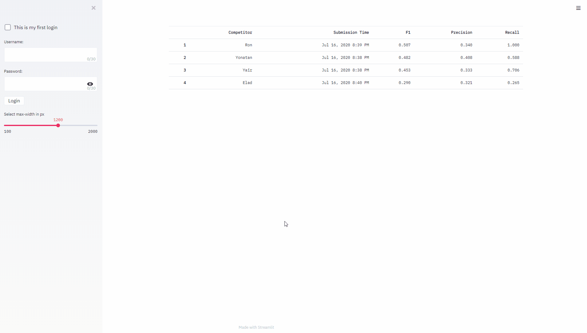

# streamlit-leaderboard
A general purpose leaderboard using [Streamlit](https://docs.streamlit.io/en/stable/).

Can be used for small machine learning competitions, or just for conveniently keeping score
 of the performance of various methods/models.

## Demo



## Installation
This repository requires Python 3.6 or higher.

Run the following commands to clone the repository and install streamlit-leaderboard:
```
git clone https://github.com/yairf11/streamlit-leaderboard.git
cd streamlit-leaderboard; pip install -r requirements.txt
```

## Usage
To run the leaderboard, just run the following command:
```
streamlit run src/app.py
```

## Configure your leaderboard
You can easily configure the leaderboard for your purposes. 
In the file [config.py](src/config.py), 
you can edit the following variables which control the app's most basic behavior:

`EVALUATOR_CLASS`: A subclass of the [Evaluator](src/evaluation/evaluator.py) class
 used for the evaluation of the users' submissions. 
 This is the most important configuration, 
 and you must implement your own evaluator class. 
 See [this example implementation](src/examples/f1_precision_recall_example.py)
  for detailed information.

`SUBMISSIONS_DIR`: A [pathlib.Path](https://docs.python.org/3/library/pathlib.html) object 
 holding the path to the directory in which the users' submissions will be saved.

`PASSWORDS_DB_FILE`: A [pathlib.Path](https://docs.python.org/3/library/pathlib.html) object 
 holding the path to the encrypted passwords DB.

`ARGON2_KWARGS`: A dictionary holding keyword arguments for the 
 [argon2 password hasher](https://argon2-cffi.readthedocs.io/en/stable/api.html#argon2.PasswordHasher).

`MAX_NUM_USERS`: The maximum number of users allowed in the system. If `None`, no limitation is enforced.

`ALLOWED_SUBMISSION_FILE_EXTENSION`: The extension type required for a 
 submission file (e.g. `".json"`). If `None`, any extension is allowed.

`SHOW_TOP_K_ONLY`: The number of top competitors to display on the leaderboard. Users ranked below the k'th place will not be visible to other users.

`ADMIN_USERNAME`: The username of the admin of the leaderboard. The admin cannot submit to the leaderboard, but he can view the entire leaderboard (regardless of the `SHOW_TOP_K_ONLY` parameter) and view the personal progress of each competitor.

Lastly, if you want to change some of [Streamlit's defaults](https://docs.streamlit.io/en/stable/cli.html#view-all-config-options),
 you can edit them in the [config.toml](.streamlit/config.toml) file.
 Currently, the maximum size allowed for a submission file is 1 MB (`maxUploadSize = 1`). 


